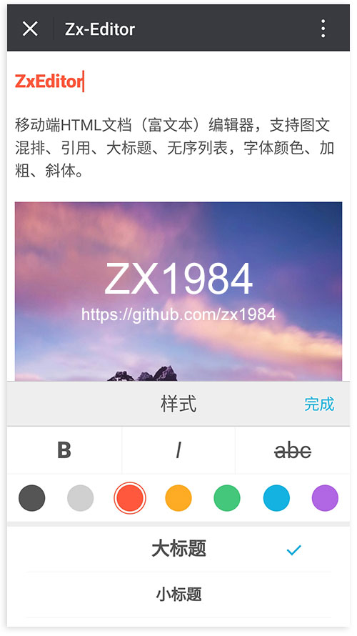

# ZxEditor

移动端HTML文档（富文本）编辑器，支持图文混排、引用、大标题、无序列表，字体颜色、加粗、斜体。



## Build Setup

* 安装项目依赖

``` bash
# install dependencies
npm install
```

* Development 开发模式

``` bash
npm run dev
```

  通过 `http://localhost:9001` 可以访问

* Production 生成项目文件

``` bash
npm run build
```

## USE

* html

```html
<div id="editorContainer">
  <!-- 编辑器容器 -->
</div>
<script src="./dist/zx-editor.js"></script>
<script>
  // 初始化ZX编辑器
  var zxEditor = new ZxEditor('#editorContainer')
  // 详见index.html文件
  // demo依赖图片预处理插件 image-process-tools
  // https://github.com/zx1984/image-process-tools
</script>
```

* ES6

```javascript
import ZxEditor from './dist/zx-editor'
// import ZxEditor from './src/zx-editor'
```

## API

* addImage(src|base64)

  向正文焦点处添加一张图片，支持图片url地址或base64数据

* getBase64Images()

  获取正文中所有base64数据的图片，返回一个数组

  @return array

  ```
    [
      {
        id: 'zxEditor_img_1500001511111',
        data: 'data:image/jpeg;base64,/9j4AAQSkZJDAAkGB+wgH....'
      }
    ]
  ```

* toBlobData(base64)

  将图片base64转换为原始数据类型Blob()，该数据和表单中提交上传的数据同类型，故可以直接上传

  @return new Blob() 返回Blob()数据

* setImageSrc(imgId, imgUrl)

  将ID为imgId的图片base64地址，替换为新的imgUrl

  @return boolean

* getContent()

  获取正文内容html

## Copyright and license

Code and documentation copyright 2018 zx1984. Code released under the MIT License.


